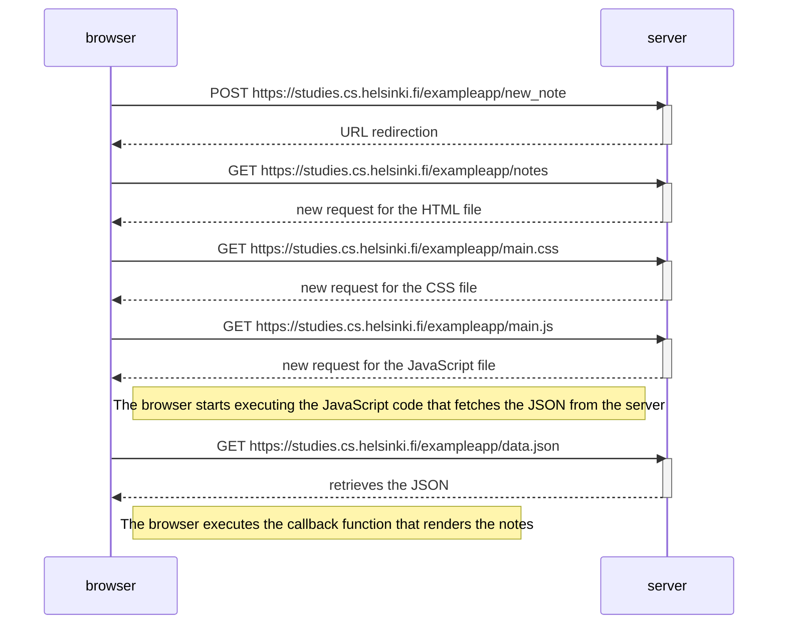
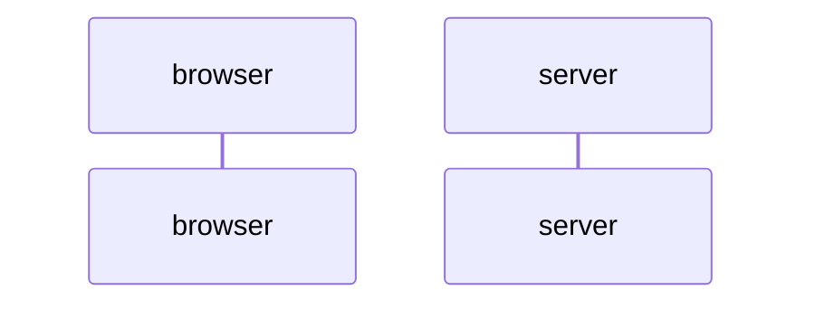

# Part 0 | excercises 0.3 to 0.6
>The first excersise to showcase in this repository starts in 0.4

## 0.4
- Illustration of the sequence for adding a new note after submitting it through the form.

## 0.5
- Illustration of the sequence to access an SPA

